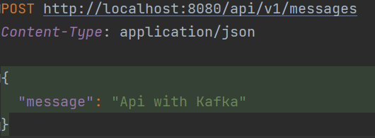
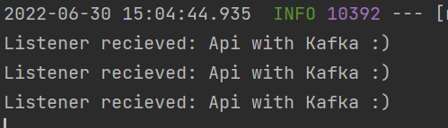

# KafkaApplication
Simple Apache Kafka Producer and Consumer application 

## Getting Started

Start Kafka Zookeeper and Kafka Broker by executing command 'docker-compose up' in directory where docker-compose is located.  
Start Spring Boot application which creates Producer and Consumer that use topic 'alvar'  

Can send messages to consumer through API endpoint localhost:8080/api/v1/messages  

 

Messages can be seen in Spring Boot application terminal window. 

